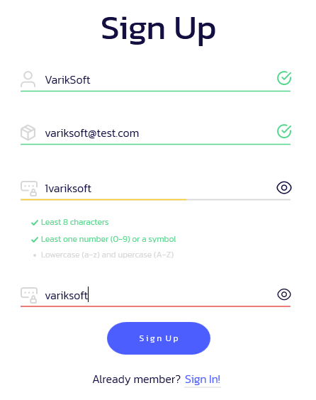
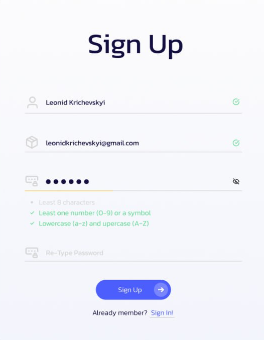

# 🎵 VinylVerse

**VinylVerse** is a desktop music app built as a student project — completed just 16 hours before the deadline (yes, really 😅).  
Developed in **C#** with **WPF**, it supported streaming via a custom server using NuGet-based delivery.

> The server is long gone and the backend no longer works, but I’m leaving the code here — maybe someone finds it useful someday.  
> Just be warned: the code is absolute spaghetti. This was a "get it done or die" kind of project.

## 🧪 Tech Stack

```bash
🟣 Language:     C#
🖼  Framework:    WPF (Windows Presentation Foundation)
📦 Streaming:    NuGet-based track loading via custom backend (no longer active)
```

## 📸 Screenshots
These are old previews of the interface from the working prototype:

🎧 Playlist Interface


📝 Sign-Up Screen


## 🧠 Final Thoughts
If you’re looking at this wondering “what was going on here?”
> Just remember: it worked... once... under pressure.

Feel free to fork or reuse anything — no license, no expectations.

> [!WARNING]
> ⚠️ This project is NOT maintained.
> 🚫 Server backend is offline.
> 💀 Code quality is chaotic at best.
